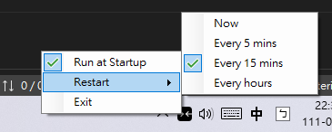

# Snap Assist for Centering

> [English](README.md) 中文

這個程式是為了補足 Windows Snap Assist，使得視窗的置中可以簡單地透過把視窗拖曳到螢幕工作區中央來達成。

## 用法

拖曳視窗時將鼠標移到螢幕工作區中央的指示視窗上再放開左鍵，拖曳的視窗就會自動置中到螢幕工作區。

透過系統列的圖示可以終止程式或設定在開機時自動啟動。

如果指示視窗沒有被置頂，請透過系統列的圖示重新啟動程式。你也可以讓程式每隔一段時間自動重新啟動。

## 開發

由於C++的諸多限制，此程式已用C#改寫。

## 授權

[MIT](http://opensource.org/licenses/MIT)

版權所有 © 民國110年，veringsek