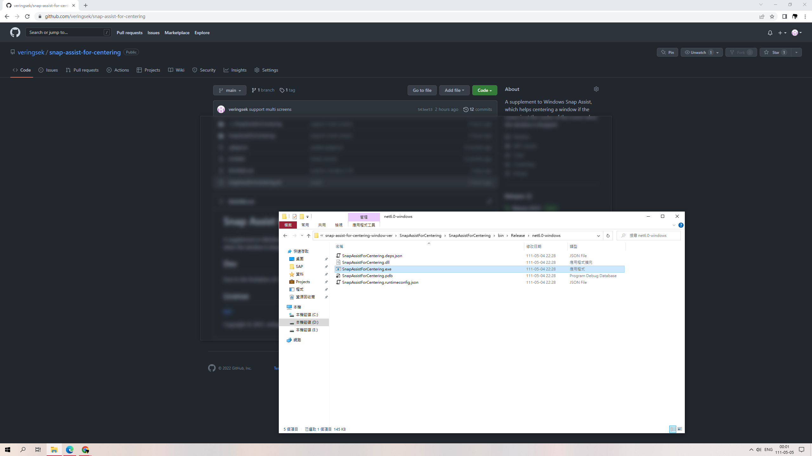

# Snap Assist for Centering

A supplement to Windows Snap Assist, which helps centering a window if the cursor is at the center of the screen when the window is dropped. 

## Usage

Drag and drop a window onto the indicator window at the center of the screens to center that window.

## Dev

Due to the limitation of C++, this program has been remade in C#.

## License

[MIT](http://opensource.org/licenses/MIT)

Copyright © 2021, veringsek