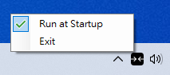

# Snap Assist for Centering

> English [中文](READEME-zh.md)

A supplement to Windows Snap Assist which helps centering a window if the cursor is at the center of the screen when the window is dropped. 

## Usage

Drag and drop a window onto the indicator window at the center of the screens to center that window.

You can exit the program or set to run at startup with the system tray icon.

If for some reason the indicator window is not at topmost, restart the program with the system tray icon.

## Dev

Due to the limitation of C++, this program has been remade in C#.

## License

[MIT](http://opensource.org/licenses/MIT)

Copyright © 2021, veringsek